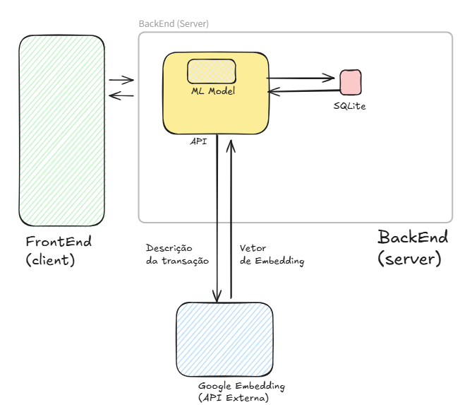

# Controle Financeiro API

Este é o repositório do back-end do projeto **Controle Financeiro**, desenvolvido como parte do MVP (Minimum Viable Product) para a Pós-Graduação em Engenharia de Software da PUC Rio. O objetivo do projeto é fornecer uma plataforma inteligente para gerenciar finanças pessoais, permitindo o controle de transações, categorias e usuários de forma eficiente, com **classificação automática** de transações utilizando **Machine Learning**.

Outros repositórios associados:
* Front-end [https://github.com/GuilhermePFM/mvp-front-end](https://github.com/GuilhermePFM/mvp-front-end).
* Embedding API [https://github.com/GuilhermePFM/mvp-front-end](https://github.com/GuilhermePFM/mvp-embedding).
---

## Índice
- [Controle Financeiro API](#controle-financeiro-api)
  - [Índice](#índice)
  - [Descrição](#descrição)
  - [Arquitetura do Sistema](#arquitetura-do-sistema)
  - [Funcionalidades Principais](#funcionalidades-principais)
    - [🗄️ Gerenciamento de Dados (CRUD)](#️-gerenciamento-de-dados-crud)
    - [🤖 Classificação Inteligente com Machine Learning](#-classificação-inteligente-com-machine-learning)
    - [🔒 Segurança](#-segurança)
    - [📊 Documentação Automática](#-documentação-automática)
  - [Estrutura de Arquivos do Projeto](#estrutura-de-arquivos-do-projeto)
    - [Descrição dos Diretórios](#descrição-dos-diretórios)
      - [**`apis/`**](#apis)
      - [**`machine_learning/`**](#machine_learning)
      - [**`model/`**](#model)
      - [**`schemas/`**](#schemas)
      - [**`security/`**](#security)
      - [**`tests/`**](#tests)
  - [Como Funciona a Classificação Inteligente](#como-funciona-a-classificação-inteligente)
    - [Fluxo de Classificação](#fluxo-de-classificação)
    - [Tecnologias de Machine Learning](#tecnologias-de-machine-learning)
  - [Tecnologias Utilizadas](#tecnologias-utilizadas)
    - [Backend e API](#backend-e-api)
    - [Banco de Dados](#banco-de-dados)
    - [Machine Learning](#machine-learning)
    - [Segurança](#segurança)
    - [Desenvolvimento e Testes](#desenvolvimento-e-testes)
  - [Configuração do Ambiente](#configuração-do-ambiente)
    - [Variáveis de Ambiente](#variáveis-de-ambiente)
  - [Como Instalar as Dependências](#como-instalar-as-dependências)
    - [1. **Clone o Repositório**](#1-clone-o-repositório)
    - [2. **Crie um Ambiente Virtual**](#2-crie-um-ambiente-virtual)
    - [3. **Ative o Ambiente Virtual**](#3-ative-o-ambiente-virtual)
    - [4. **Instale as Dependências**](#4-instale-as-dependências)
    - [5. **Configure as Variáveis de Ambiente**](#5-configure-as-variáveis-de-ambiente)
  - [Como Executar o Código](#como-executar-o-código)
    - [1. **Inicie a Aplicação**](#1-inicie-a-aplicação)
    - [2. **Acesse a API**](#2-acesse-a-api)
    - [3. **Acesse a Documentação Interativa**](#3-acesse-a-documentação-interativa)
  - [🐳 Implantação com Docker](#-implantação-com-docker)
    - [Pré-requisitos](#pré-requisitos)
    - [Desenvolvimento Local com Docker](#desenvolvimento-local-com-docker)
      - [1. **Configure as Variáveis de Ambiente**](#1-configure-as-variáveis-de-ambiente)
      - [2. **Build e Inicie os Containers**](#2-build-e-inicie-os-containers)
      - [3. **Verifique os Logs**](#3-verifique-os-logs)
      - [4. **Acesse a Aplicação**](#4-acesse-a-aplicação)
      - [5. **Parar a Aplicação**](#5-parar-a-aplicação)
    - [Volumes e Persistência de Dados](#volumes-e-persistência-de-dados)
    - [Portas Expostas](#portas-expostas)
  - [Endpoints da API](#endpoints-da-api)
    - [Documentação Interativa](#documentação-interativa)
    - [Principais Endpoints](#principais-endpoints)
      - [🤖 **Classificação de Transações**](#-classificação-de-transações)
      - [👤 **Usuários**](#-usuários)
      - [💰 **Transações**](#-transações)
      - [🏷️ **Categorias**](#️-categorias)
      - [📋 **Tipos de Transação**](#-tipos-de-transação)
  - [Testes](#testes)
    - [Executar Todos os Testes](#executar-todos-os-testes)
    - [Executar Testes Específicos](#executar-testes-específicos)
    - [Executar com Cobertura](#executar-com-cobertura)
    - [Estrutura de Testes](#estrutura-de-testes)
  - [Segurança](#segurança-1)
    - [🔐 Criptografia de Dados](#-criptografia-de-dados)
    - [🛡️ Proteção de Informações Pessoais](#️-proteção-de-informações-pessoais)

---

## Descrição

A **API ControleFinanceiro** é um sistema de gerenciamento financeiro desenvolvido para ajudar os usuários a rastrear suas transações, gerenciar categorias e organizar suas finanças de forma inteligente. Construída com **Python** e **Flask**, a API utiliza **SQLAlchemy** para gerenciamento de banco de dados, **Pydantic** para validação de esquemas, e **scikit-learn** para classificação automática de transações.

O diferencial deste sistema é a **classificação automática de transações** usando modelos de Machine Learning treinados, que analisam a descrição, valor e data das transações para categorizá-las automaticamente, economizando tempo e aumentando a precisão no controle financeiro.

---

## Arquitetura do Sistema

O projeto **Controle Financeiro** é composto por **três microserviços** que trabalham em conjunto:



**1. Interface (Front-end):** Aplicação web onde o usuário interage, faz upload de transações e visualiza os resultados.

**2. Backend API (Este Repositório):** Serviço principal que gerencia dados, executa classificações e coordena a comunicação entre os serviços.

**3. API de Embeddings:** Serviço externo (Google Gemini API) que gera embeddings semânticos das descrições das transações para melhorar a precisão da classificação.


---

## Funcionalidades Principais

### 🗄️ Gerenciamento de Dados (CRUD)
- **Usuários**: Criar, listar, buscar e excluir usuários
- **Transações**: Adicionar transações individuais ou em lote, listar e excluir
- **Categorias**: Gerenciar categorias de transações (ex: Alimentação, Transporte, Lazer)
- **Tipos de Transação**: Gerenciar tipos (Receita, Despesa)

### 🤖 Classificação Inteligente com Machine Learning
- **Classificação em Lote**: Endpoint `/batchclassifier` que classifica múltiplas transações automaticamente
- **Modelo Treinado**: Utiliza modelo scikit-learn treinado com dados históricos
- **Feature Engineering Avançada**: 
  - Embeddings semânticos das descrições via Google Gemini API
  - Extração de palavras-chave relevantes (PIX, Uber, etc.)
  - Features temporais (dia, mês)
  - Normalização de valores numéricos

### 🔒 Segurança
- **Criptografia de Dados**: Datasets sensíveis são criptografados usando chaves simétricas
- **Proteção de Informações**: Sistema de criptografia para proteger dados financeiros armazenados

### 📊 Documentação Automática
- **Swagger UI**: Interface interativa para testar todos os endpoints
- **OpenAPI 3.0**: Documentação completa e automática da API

---

## Estrutura de Arquivos do Projeto

```
ControleFinanceiro/
├── apis/                          # Endpoints da API
│   ├── batch_classifier.py        # Endpoint de classificação em lote
│   ├── transactions.py            # CRUD de transações
│   ├── transactions_category.py   # CRUD de categorias
│   ├── transactions_type.py       # CRUD de tipos
│   └── users.py                   # CRUD de usuários
│
├── machine_learning/              # Módulo de Machine Learning
│   ├── transactions_classification/
│   │   ├── lib/                   # Bibliotecas de processamento
│   │   │   ├── data_loader.py     # Carregamento de dados
│   │   │   ├── feature_engineering.py  # Extração de features
│   │   │   ├── google_embedding.py     # Integração com Gemini API
│   │   │   ├── preprocess.py      # Preprocessamento de dados
│   │   │   ├── tokenization.py    # Tokenização de texto
│   │   │   └── training.py        # Treinamento de modelos
│   │   ├── models/                # Modelos treinados (.pkl)
│   │   │   ├── classification_model.pkl
│   │   │   └── embedding_classification_model.pkl
│   │   ├── pipelines/             # Pipelines de preprocessamento
│   │   │   └── classification_preprocessor.pkl
│   │   ├── data/                  # Datasets para treinamento
│   │   └── notebooks/             # Notebooks de experimentação
│   ├── transactions_classifier.py # Classe principal do classificador
│   └── utils.py                   # Utilitários gerais
│
├── model/                         # Modelos de dados (SQLAlchemy)
│   ├── base.py                    # Classe base para modelos
│   ├── batch_job.py               # Modelo de job assíncrono (NOVO)
│   ├── transaction.py             # Modelo de transação
│   ├── transaction_category.py    # Modelo de categoria
│   ├── transaction_type.py        # Modelo de tipo
│   └── user.py                    # Modelo de usuário
│
├── schemas/                       # Schemas de validação (Pydantic)
│   ├── batch_classifier.py        # Schema para classificação
│   ├── batch_job.py               # Schema para jobs assíncronos (NOVO)
│   ├── error.py                   # Schema de erros
│   ├── transaction.py             # Schema de transação
│   ├── transaction_category.py    # Schema de categoria
│   ├── transaction_type.py        # Schema de tipo
│   └── user.py                    # Schema de usuário
│
├── security/                      # Módulos de segurança
│   ├── dataset.py                 # Criptografia de datasets
│   ├── salting.py                 # Geração de salts
│   ├── signing.py                 # Assinatura digital
│   ├── user_data.py               # Proteção de dados do usuário
│   └── symmetric/                 # Criptografia simétrica
│       └── utils.py
│
├── tests/                         # Testes automatizados
│   ├── test_async_batch_classifier.py  # Testes de endpoints assíncronos (NOVO)
│   ├── test_dataset_encryption.py # Testes de criptografia
│   ├── test_integration_transactions_ml_model.py  # Testes de integração
│   ├── test_transactions_ml_model.py  # Testes do modelo ML
│   └── classification_fixtures/   # Fixtures para testes
│
├── database/                      # Banco de dados SQLite
│   └── db.sqlite3
│
├── kafka/                        # Infraestrutura Kafka para processamento assíncrono
│   ├── __init__.py                # Package init
│   ├── batch_job_publisher.py    # Publisher para jobs assíncronos
│   ├── embeddings_worker.py      # Worker 1: Processa embeddings
│   ├── classification_worker.py  # Worker 2: Executa classificação
│   ├── utils.py                   # Utilitários (retry, backoff)
│   ├── job_cleanup.py             # Script de limpeza de jobs antigos
│   ├── embeddings_consumer.py     # Consumer legado de embeddings
│   ├── text_description_publisher.py  # Publisher legado
│   └── process_classification_data.py # Processamento legado
│
├── template/                      # Template Excel para upload
│   └── template.xlsx
│
├── log/                           # Logs da aplicação
│
├── app.py                         # Configuração principal do Flask
├── config.py                      # Configuração do OpenAPI/Swagger
├── logger.py                      # Sistema de logs
├── requirements.txt               # Dependências Python
├── env.example                    # Exemplo de variáveis de ambiente
└── README.md                      # Este arquivo
```

### Descrição dos Diretórios

#### **`apis/`**
Contém todos os endpoints REST da API organizados por domínio:
- **`batch_classifier.py`**: Endpoint para classificação automática em lote de transações usando ML
- **`transactions.py`**: Endpoints para gerenciar transações (adicionar, listar, excluir)
- **`transactions_category.py`**: Endpoints para gerenciar categorias de transações
- **`transactions_type.py`**: Endpoints para gerenciar tipos de transações
- **`users.py`**: Endpoints para gerenciar usuários do sistema

#### **`machine_learning/`**
Módulo completo de Machine Learning para classificação de transações:
- **`lib/`**: Bibliotecas customizadas para processamento e treinamento
  - Feature engineering (extração de palavras-chave, datas)
  - Integração com Google Gemini API para embeddings
  - Preprocessamento e normalização de dados
  - Tokenização de texto
- **`models/`**: Modelos treinados salvos em formato pickle
- **`pipelines/`**: Pipelines de preprocessamento serializados
- **`notebooks/`**: Jupyter notebooks para experimentação e análise
- **`transactions_classifier.py`**: Classe principal que encapsula o modelo de classificação

#### **`model/`**
Define os modelos de dados usando SQLAlchemy ORM:
- **`base.py`**: Classe base para todos os modelos
- **`transaction.py`**: Modelo de transação financeira
- **`transaction_category.py`**: Modelo de categoria (ex: Alimentação, Transporte)
- **`transaction_type.py`**: Modelo de tipo (Receita ou Despesa)
- **`user.py`**: Modelo de usuário

#### **`schemas/`**
Define os schemas de validação usando Pydantic:
- Validação automática de dados de entrada
- Serialização de respostas da API
- Documentação automática no Swagger

#### **`security/`**
Módulos de segurança para proteção de dados sensíveis:
- Criptografia simétrica de datasets
- Proteção de informações financeiras
- Assinatura e validação de dados

#### **`tests/`**
Suíte completa de testes automatizados:
- Testes de integração do modelo ML
- Testes de criptografia
- Fixtures para validação de performance do modelo

---

## Como Funciona a Classificação Inteligente

### Fluxo de Classificação

```
┌─────────────────────────────────────────────────────────────────┐
│              FLUXO DE CLASSIFICAÇÃO DE TRANSAÇÕES                │
└─────────────────────────────────────────────────────────────────┘

1. 📤 Usuário envia transações
   └─► Endpoint: POST /batchclassifier
       Payload: [{value, date, description}, ...]

2. 🔄 Preprocessamento
   └─► Normalização de valores
   └─► Parsing de datas
   └─► Limpeza de descrições

3. 🧬 Feature Engineering
   └─► Extração de palavras-chave (pix, uber, ifd, pag, etc.)
   └─► Features temporais (dia, mês)
   └─► Normalização de valores numéricos
   └─► Embeddings semânticos via Google Gemini API

4. 🤖 Classificação
   └─► Pipeline de preprocessamento carregado
   └─► Modelo scikit-learn faz predições
   └─► Cada transação recebe uma categoria

5. 📥 Retorno dos Resultados
   └─► Transações com categorias atribuídas
   └─► Formato JSON estruturado
```

### Tecnologias de Machine Learning

**Modelo de Classificação:**
- **Framework**: scikit-learn
- **Tipo**: Classificação supervisionada
- **Features**:
  - **Numéricas**: Valores das transações (normalizados)
  - **Temporais**: Dia e mês da transação
  - **Textuais**: Embeddings das descrições + keywords extraídas
  
**Embeddings Semânticos:**
- **Provedor**: Google Gemini API
- **Modelo**: `gemini-embedding-001`
- **Dimensionalidade**: 768 dimensões
- **Normalização**: Embeddings normalizados para melhor performance

**Feature Engineering:**
- Detecção de palavras-chave relevantes: `pix`, `uber`, `ifd`, `pag`, `aplicação`, `salário`, `light`
- Extração de features temporais: dia e mês da transação
- Normalização de valores numéricos usando `StandardScaler`
- Normalização de embeddings usando `Normalizer`

**Pipeline de Preprocessamento:**
- `ColumnTransformer` para aplicar transformações específicas por tipo de feature
- `FeatureUnion` para combinar diferentes representações textuais
- Serialização completa para garantir consistência em produção

---

## Arquitetura Assíncrona de Classificação em Lote

Para lidar com volumes maiores de dados e tempos de resposta mais longos do serviço de embeddings, o sistema oferece uma **arquitetura assíncrona baseada em Kafka** que desacopla o processamento de classificação da requisição HTTP.

### Fluxo Assíncrono

```
┌──────────────────────────────────────────────────────────────────────┐
│           ARQUITETURA ASSÍNCRONA DE CLASSIFICAÇÃO                     │
└──────────────────────────────────────────────────────────────────────┘

1. 📤 Frontend: POST /api/batch-classify-async
   └─► Retorna imediatamente: { "jobId": "uuid" }
   └─► Status: 202 Accepted

2. 💾 Job criado no banco de dados
   └─► Status: pending
   └─► Dados armazenados: transações de entrada

3. 📨 Job publicado no Kafka
   └─► Tópico: batch-jobs
   └─► Workers consomem assincronamente

4. 🔄 Worker 1: Embeddings
   ├─► Consome de: batch-jobs
   ├─► Atualiza status: processing
   ├─► Chama API externa de embeddings
   ├─► Retry automático (3x com backoff exponencial)
   └─► Publica em: embeddings-results

5. 🤖 Worker 2: Classification
   ├─► Consome de: embeddings-results
   ├─► Combina embeddings + transações
   ├─► Executa modelo ML de classificação
   ├─► Atualiza status: completed
   └─► Armazena resultados no banco

6. 🔍 Frontend: Polling GET /api/batch-jobs/{jobId}
   ├─► Status: pending → processing → completed
   ├─► Quando completed: retorna transações classificadas
   └─► Job é deletado após fetch bem-sucedido
```

### Componentes da Arquitetura

**1. API Endpoints**

**`POST /api/batch-classify-async`**
- Aceita lista de transações
- Cria job no banco de dados
- Publica no Kafka
- Retorna `202 Accepted` com `jobId`

**`GET /api/batch-jobs/{jobId}`**
- Retorna status atual do job
- Estados possíveis: `pending`, `processing`, `completed`, `failed`
- Quando `completed`: inclui transações classificadas
- Job é deletado após fetch bem-sucedido

**2. Tópicos Kafka**

| Tópico | Produtor | Consumidor | Conteúdo |
|--------|----------|------------|----------|
| `batch-jobs` | API Flask | Embeddings Worker | Job ID + transações |
| `embeddings-results` | Embeddings Worker | Classification Worker | Job ID + transações + embeddings |

**3. Workers**

**Embeddings Worker** (`kafka/embeddings_worker.py`)
- Consome jobs do tópico `batch-jobs`
- Extrai descrições das transações
- Chama API externa de embeddings com retry (3x)
- Publica resultados em `embeddings-results`
- Gerencia falhas e atualiza status no banco

**Classification Worker** (`kafka/classification_worker.py`)
- Consome do tópico `embeddings-results`
- Combina embeddings com dados das transações
- Executa modelo ML de classificação
- Salva resultados no banco de dados
- Marca job como `completed`

**4. Banco de Dados**

**Modelo `BatchJob`** (`model/batch_job.py`)
- `id`: UUID único do job
- `status`: pending | processing | completed | failed
- `created_at`, `updated_at`: Timestamps
- `transactions_input`: JSON com transações de entrada
- `transactions_output`: JSON com transações classificadas
- `error_message`: Mensagem de erro (se falhar)
- `retry_count`: Contador de tentativas

### Tratamento de Erros e Retry

**Estratégia de Retry**
- **3 tentativas** para chamadas à API de embeddings
- **Backoff exponencial**: 2s → 4s → 8s
- Erros são logados com detalhes completos
- Job marcado como `failed` após esgotamento de tentativas

**Estados de Erro**
- `failed`: Erro irrecuperável (API indisponível, dados inválidos)
- Mensagem de erro detalhada retornada no GET

**Cleanup Automático**
- Jobs completados são deletados após fetch
- Fallback: Script `kafka/job_cleanup.py` remove jobs com > 24h
- Pode ser executado via cron para manutenção

### Como Executar o Sistema Assíncrono

**1. Iniciar Kafka**
```bash
# Usando Docker (recomendado)
docker run -d --name kafka \
  -p 9092:9092 \
  -e KAFKA_ENABLE_KRAFT=yes \
  apache/kafka:latest

# Ou instale localmente e inicie o broker
```

**2. Configurar Variáveis de Ambiente**
```bash
# Adicione ao arquivo .env
KAFKA_BROKER_ADDRESS=localhost:9092
BATCH_JOBS_TOPIC=batch-jobs
EMBEDDINGS_RESULTS_TOPIC=embeddings-results
EMBEDDINGS_CONSUMER_GROUP=embeddings_worker
CLASSIFICATION_CONSUMER_GROUP=classification_worker
EMBEDDING_API_URL=http://localhost:8000
```

**3. Iniciar Workers**
```bash
# Terminal 1: Embeddings Worker
python kafka/embeddings_worker.py

# Terminal 2: Classification Worker
python kafka/classification_worker.py
```

**4. Iniciar API**
```bash
# Terminal 3: Flask API
python app.py
```

**5. Manutenção (Opcional)**
```bash
# Executar cleanup manual de jobs antigos
python kafka/job_cleanup.py

# Ou agendar via cron (Linux/Mac)
# Adicione ao crontab: 0 2 * * * cd /path/to/project && python kafka/job_cleanup.py
```

### Exemplo de Uso

**Requisição:**
```bash
curl -X POST http://localhost:5000/api/batch-classify-async \
  -H "Content-Type: application/json" \
  -d '{
    "transactions": [
      {
        "date": "2024-01-15T00:00:00",
        "description": "Grocery shopping",
        "value": 150.50,
        "user": "John Doe",
        "classification": null
      }
    ]
  }'
```

**Resposta (202 Accepted):**
```json
{
  "jobId": "550e8400-e29b-41d4-a716-446655440000"
}
```

**Polling Status:**
```bash
# Polling a cada 2 segundos
curl http://localhost:5000/api/batch-jobs/550e8400-e29b-41d4-a716-446655440000

# Resposta (processing):
{"status": "processing"}

# Resposta (completed):
{
  "status": "completed",
  "transactions": [
    {
      "date": "2024-01-15T00:00:00",
      "description": "Grocery shopping",
      "value": 150.50,
      "user": "John Doe",
      "classification": "Food & Groceries"
    }
  ]
}
```

### Monitoramento e Troubleshooting

**Verificar Status dos Workers**
```bash
# Workers devem exibir logs como:
# ============================================================
# EMBEDDINGS WORKER STARTING
# ============================================================
# Starting embeddings worker, consuming from batch-jobs
```

**Logs Importantes**
- Workers logam cada mensagem processada
- Erros são logados com stack trace completo
- Kafka offsets são commitados apenas após sucesso

**Problemas Comuns**

| Problema | Causa Provável | Solução |
|----------|----------------|---------|
| Job fica `pending` indefinidamente | Workers não estão rodando | Inicie os workers |
| Status `failed` com erro de API | API de embeddings offline | Verifique `EMBEDDING_API_URL` |
| Workers crasham ao iniciar | Kafka não está acessível | Verifique `KAFKA_BROKER_ADDRESS` |
| Job não encontrado (404) | Job já foi fetcheado | Jobs são deletados após fetch |

### Performance e Escalabilidade

**Throughput**
- Limitado pela API externa de embeddings
- Tipicamente: 5-30 segundos por job
- Varia com tamanho do lote e latência da API

**Escalabilidade Horizontal**
- Workers podem ser escalados independentemente
- Kafka distribui carga automaticamente
- Múltiplas instâncias do mesmo consumer group

**Otimizações Futuras**
- Cache de embeddings para descrições similares
- Batching de múltiplos jobs para API de embeddings
- WebSockets para notificações ao invés de polling

---

## Tecnologias Utilizadas

### Backend e API
- **Flask 3.1.0**: Framework web minimalista e flexível
- **Flask-OpenAPI3**: Documentação automática OpenAPI 3.0
- **Flask-CORS**: Gerenciamento de CORS para comunicação com frontend
- **Pydantic 2.10.6**: Validação de dados e serialização
- **Kafka/quixstreams 2.4**: Message broker para processamento assíncrono

### Banco de Dados
- **SQLAlchemy 2.0.39**: ORM para Python
- **SQLite**: Banco de dados relacional leve

### Machine Learning
- **scikit-learn 1.7.0**: Modelos de classificação e pipelines
- **pandas 2.3.0**: Manipulação de dados
- **numpy 2.2.6**: Computação numérica
- **google-genai 1.53.0**: Cliente para Google Gemini API

### Segurança
- **cryptography 45.0.5**: Criptografia de dados sensíveis
- **python-dotenv 1.2.1**: Gerenciamento de variáveis de ambiente

### Desenvolvimento e Testes
- **pytest 8.4.0**: Framework de testes
- **jupyter**: Notebooks para experimentação
- **joblib**: Serialização de modelos

---

## Configuração do Ambiente

### Variáveis de Ambiente

Crie um arquivo `.env` na raiz do projeto baseado no arquivo `env.example`:

```bash
# Chave da API do Google Gemini (OBRIGATÓRIO para classificação)
GEMINI_API_KEY=sua_chave_api_aqui

# Modelo de embedding (OPCIONAL - padrão: models/gemini-embedding-001)
GEMINI_MODEL=models/gemini-embedding-001

# Caminho customizado para modelos ML (OPCIONAL)
# Se não especificado, usa: machine_learning/transactions_classification/models
MODEL_PATH=

# Chave de criptografia para datasets (OBRIGATÓRIO para funcionalidades de segurança)
ENC_KEY=sua_chave_de_criptografia_aqui

# Kafka Configuration (para processamento assíncrono)
KAFKA_BROKER_ADDRESS=localhost:9092
BATCH_JOBS_TOPIC=batch-jobs
EMBEDDINGS_RESULTS_TOPIC=embeddings-results
EMBEDDINGS_CONSUMER_GROUP=embeddings_worker
CLASSIFICATION_CONSUMER_GROUP=classification_worker

# External Embedding API
EMBEDDING_API_URL=http://localhost:8000
```

**A API Key do Google Gemini foi enviada na descrição do MVP, pela plataforma.**

---

## Como Instalar as Dependências

Siga os passos abaixo para configurar o ambiente de desenvolvimento:

### 1. **Clone o Repositório**
```bash
git clone https://github.com/GuilhermePFM/mvp-api
cd mvp-api
```

### 2. **Crie um Ambiente Virtual**
É recomendado usar um ambiente virtual para isolar as dependências:

```bash
python -m venv venv
```

### 3. **Ative o Ambiente Virtual**

**No Windows:**
```bash
venv\Scripts\activate
```

**No macOS/Linux:**
```bash
source venv/bin/activate
```

### 4. **Instale as Dependências**
```bash
pip install -r requirements.txt
```

Este comando instala todas as bibliotecas necessárias listadas no arquivo `requirements.txt`, incluindo Flask, SQLAlchemy, scikit-learn, e outras dependências essenciais.

### 5. **Configure as Variáveis de Ambiente**
```bash
# Copie o arquivo de exemplo
cp env.example .env

# Edite o arquivo .env e adicione suas chaves
# Certifique-se de adicionar sua GEMINI_API_KEY
```

---

## Como Executar o Código

### 1. **Inicie a Aplicação**
```bash
python -m flask run --no-debugger --no-reload
```

Ou simplesmente:
```bash
python app.py
```

### 2. **Acesse a API**
A API estará disponível em: [http://127.0.0.1:5000](http://127.0.0.1:5000)

### 3. **Acesse a Documentação Interativa**
A interface Swagger estará disponível em:
- **Swagger UI**: [http://127.0.0.1:5000/openapi/swagger](http://127.0.0.1:5000/openapi/swagger)
- **ReDoc**: [http://127.0.0.1:5000/openapi/redoc](http://127.0.0.1:5000/openapi/redoc)

---

## 🐳 Implantação com Docker

Docker permite executar a aplicação em um ambiente isolado e consistente, facilitando o desenvolvimento e a implantação em produção.

### Pré-requisitos

- **Docker**: [Instalar Docker](https://docs.docker.com/get-docker/)
- **Docker Compose**: [Instalar Docker Compose](https://docs.docker.com/compose/install/)

### Desenvolvimento Local com Docker

Para executar a aplicação em ambiente de desenvolvimento usando Docker:

#### 1. **Configure as Variáveis de Ambiente**
```bash
# Copie o arquivo de exemplo
cp env.example .env

# Edite o arquivo .env e adicione suas chaves
# IMPORTANTE: Adicione sua GEMINI_API_KEY
```

#### 2. **Build e Inicie os Containers**
```bash
docker-compose up -d
```

Este comando irá:
- Construir a imagem Docker da aplicação
- Iniciar o container em segundo plano (`-d` = detached)
- Montar volumes para persistência de dados

#### 3. **Verifique os Logs**
```bash
# Ver logs em tempo real
docker-compose logs -f

# Ver logs apenas do serviço app
docker-compose logs -f app
```

#### 4. **Acesse a Aplicação**
- **API**: [http://localhost:5000](http://localhost:5000)
- **Swagger UI**: [http://localhost:5000/openapi/swagger](http://localhost:5000/openapi/swagger)

#### 5. **Parar a Aplicação**
```bash
# Parar containers (mantém volumes)
docker-compose down

# Parar e remover volumes (⚠️ apaga dados)
docker-compose down -v
```

### Volumes e Persistência de Dados

O Docker está configurado com os seguintes volumes para garantir persistência:

| Volume | Diretório Host | Diretório Container | Descrição |
|--------|---------------|---------------------|-----------|
| **Database** | `./database/` | `/app/database/` | Banco de dados SQLite |
| **Logs** | `./log/` | `/app/log/` | Logs da aplicação e Gunicorn |
| **Env** | `./.env` | `/app/.env` | Variáveis de ambiente (read-only) |

**Importante**: Os dados persistem mesmo após `docker-compose down`. Use `docker-compose down -v` apenas se quiser apagar todos os dados.

### Portas Expostas

| Serviço | Porta Host | Porta Container | Descrição |
|---------|-----------|-----------------|-----------|
| **API** | 5000 | 5000 | Flask/Gunicorn API |


## Endpoints da API

### Documentação Interativa

A API oferece documentação interativa completa através do **Swagger UI**, onde você pode:
- Visualizar todos os endpoints disponíveis
- Testar requisições diretamente no navegador
- Ver exemplos de payloads e respostas
- Entender os schemas de dados

**Acesse**: [http://127.0.0.1:5000/openapi/swagger](http://127.0.0.1:5000/openapi/swagger)

### Principais Endpoints

#### 🤖 **Classificação de Transações**

**`POST /batchclassifier`** (Síncrono)
- Classifica automaticamente um lote de transações usando Machine Learning
- **Payload**: Lista de transações com `value`, `date`, `description`
- **Resposta**: Lista de transações com campo `classification` adicionado
- **Uso**: Para lotes pequenos com resposta imediata

```json
{
  "transactions": [
    {
      "value": 45.90,
      "date": "2024-01-15",
      "description": "Uber viagem centro",
      "user": 1,
      "classification": null
    }
  ]
}
```

**`POST /api/batch-classify-async`** (Assíncrono - Novo!)
- Submete job de classificação para processamento assíncrono
- **Payload**: Lista de transações (igual ao endpoint síncrono)
- **Resposta**: `202 Accepted` com `jobId` para polling
- **Uso**: Para lotes grandes ou quando o tempo de resposta é alto

```json
// Request
{
  "transactions": [
    {
      "date": "2024-01-15T00:00:00",
      "description": "Grocery shopping",
      "value": 150.50,
      "user": "John Doe",
      "classification": null
    }
  ]
}

// Response (202 Accepted)
{
  "jobId": "550e8400-e29b-41d4-a716-446655440000"
}
```

**`GET /api/batch-jobs/{jobId}`**
- Consulta status de job assíncrono
- **Resposta**: Status atual + resultados (se completo)
- **Estados**: `pending`, `processing`, `completed`, `failed`

```json
// Status: processing
{
  "status": "processing"
}

// Status: completed
{
  "status": "completed",
  "transactions": [
    {
      "date": "2024-01-15T00:00:00",
      "description": "Grocery shopping",
      "value": 150.50,
      "user": "John Doe",
      "classification": "Food & Groceries"
    }
  ]
}

// Status: failed
{
  "status": "failed",
  "message": "External API unavailable"
}
```

#### 👤 **Usuários**

- **`POST /user`**: Adiciona novo usuário
- **`GET /user?email=usuario@example.com`**: Busca usuário por email
- **`GET /users`**: Lista todos os usuários
- **`DELETE /user?email=usuario@example.com`**: Remove usuário

#### 💰 **Transações**

- **`POST /transaction`**: Adiciona nova transação individual
- **`POST /transactions`**: Adiciona múltiplas transações em lote
- **`GET /transactions`**: Lista todas as transações
- **`DELETE /transaction?id=1`**: Remove transação específica

#### 🏷️ **Categorias**

- **`POST /category`**: Cria nova categoria
- **`GET /categories`**: Lista todas as categorias
- **`DELETE /category?id=1`**: Remove categoria

#### 📋 **Tipos de Transação**

- **`POST /type`**: Cria novo tipo (Receita/Despesa)
- **`GET /types`**: Lista todos os tipos
- **`DELETE /type?id=1`**: Remove tipo

---

## Testes

O projeto inclui uma suíte de testes automatizados para garantir a qualidade e confiabilidade do código.

### Executar Todos os Testes
```bash
pytest
```

### Executar Testes Específicos
```bash
# Testes do modelo de Machine Learning
pytest tests/test_transactions_ml_model.py

# Testes de integração
pytest tests/test_integration_transactions_ml_model.py

# Testes de criptografia
pytest tests/test_dataset_encryption.py
```

### Executar com Cobertura
```bash
pytest --cov=. --cov-report=html
```

### Estrutura de Testes

- **`test_transactions_ml_model.py`**: Testa a performance e precisão do modelo de classificação
- **`test_integration_transactions_ml_model.py`**: Testa a integração completa do pipeline de ML
- **`test_dataset_encryption.py`**: Valida os mecanismos de criptografia de dados
- **`test_async_batch_classifier.py`**: Testa endpoints assíncronos, workers Kafka e retry logic
- **`classification_fixtures/`**: Fixtures com dados de teste e resultados esperados

### Testar Endpoints Assíncronos

```bash
# Testes de endpoints assíncronos
pytest tests/test_async_batch_classifier.py -v

# Testar apenas retry logic
pytest tests/test_async_batch_classifier.py::TestRetryLogic -v

# Testar job cleanup
pytest tests/test_async_batch_classifier.py::TestJobCleanup -v
```

---

## Segurança

O sistema implementa múltiplas camadas de segurança para proteger dados sensíveis:

### 🔐 Criptografia de Dados
- **Criptografia Simétrica**: Datasets com informações financeiras são criptografados antes de serem armazenados
- **Chave de Criptografia**: Gerenciada via variável de ambiente `ENC_KEY`
- **Módulo**: `security/dataset.py`

### 🛡️ Proteção de Informações Pessoais
- Dados de usuários e transações são tratados com políticas de segurança rigorosas
- Sistema de salting para proteção adicional

---

**Desenvolvido como parte do MVP para Pós-Graduação em Engenharia de Software - PUC Rio**